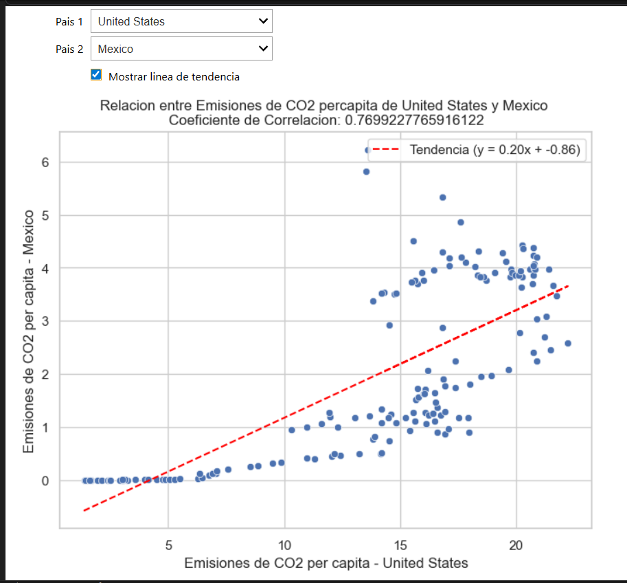

# Análisis de Emisiones de CO₂ per cápita

Análisis exploratorio de datos (EDA) para estudiar la relación entre las emisiones de CO₂ per cápita entre países, utilizando Python y herramientas de visualización.
El proyecto permite comparar países y analizar la correlación entre sus emisiones a lo largo del tiempo.

---

## Objetivo
Analizar la relación entre las emisiones de CO₂ per cápita de diferentes países y determinar si existe una correlación entre ellas.

---

## Dataset
* Fuente: Our World in Data.
* Archivo: `co2-emissions-per-capita.csv`.
* Periodo: 1750 - 2024.
* Unidad: toneladas por persona.

Información detallada del dataset disponible en:
* Metadata.
* Documentación. 

---

## Tecnologías utilizadas
* Python.
* Pandas.
* NumPy.
* Matplotlib.
* Seaborn.
* Jupyter Notebook.
* ipywidgets.

Dependencias definidas en `requirements.txt` 

---

## Análisis realizado
* Filtrado de datos por país.
* Limpieza y preparación de datos.
* Comparación entre dos países.
* Cálculo de correlación.
* Generación de gráfico de dispersión.
* Inclusión de línea de tendencia.

---

## Visualización

* Cada punto representa una observación en el tiempo.
* Se muestra la relación entre emisiones de dos países.
* Incluye línea de tendencia para identificar patrones.
* Se calcula el coeficiente de correlación.

---

## Insights
* Existe una **correlación positiva** entre las emisiones de CO₂ per cápita de los países analizados.
* A medida que aumentan las emisiones en un país, tienden a aumentar en el otro.
* La relación no es perfecta, lo que indica la presencia de otros factores (económicos, industriales, energéticos).

---

## Conceptos aplicados
* Análisis exploratorio de datos (EDA).
* Correlación entre variables.
* Visualización de datos.
* Uso de widgets interactivos.
* Interpretación de gráficos.

---

## Cómo ejecutar

1. Instalar dependencias:

```bash id="cmd6"
pip install -r requirements.txt
```

2. Ejecutar el notebook:

```bash id="cmd7"
jupyter notebook
```

3. Abrir el archivo:

```id="nb1"
analisis_co2.ipynb
```

---

## Enfoque del proyecto
Este proyecto se enfoca en análisis de datos interactivo, permitiendo:
* Seleccionar países dinámicamente.
* Visualizar relaciones entre variables.
* Explorar tendencias mediante gráficos.
